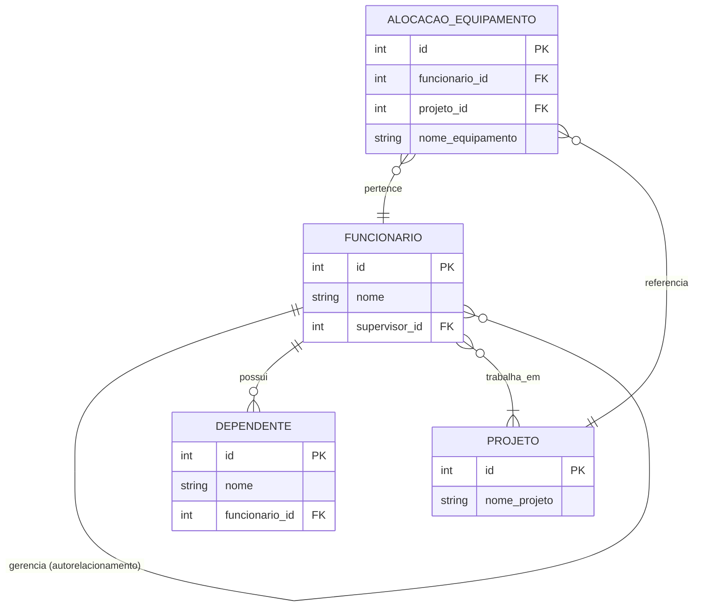

# Projeto: Autorelacionamento, Entidade Fraca e Agregacao em PostgreSQL

## Alunos
- **Giovanna Secundo Penso**
- **Carlos Vitor Camara Gomes**
- **Adam Lucas Smith de Carvalho**
- **Vinicius De Oliveira Mateus**

---

## Diagrama ER do Modelo



---

## Conceitos Demonstrados

### 1. Autorelacionamento

Um funcionario pode ser supervisionado por outro funcionario da **mesma tabela**, criando uma hierarquia organizacional.

**Como foi aplicado:**
- `Ana Silva` e CEO (supervisor_id = NULL)
- `Carlos Santos` e supervisionado por Ana (supervisor_id = 1)
- `Joao Pereira` e supervisionado por Carlos (supervisor_id = 2)

```sql
CREATE TABLE funcionario (
    id SERIAL PRIMARY KEY,
    nome VARCHAR(100) NOT NULL,
    supervisor_id INTEGER REFERENCES funcionario(id)
);
```

**Query com LEFT JOIN (dica do professor):**
```sql
SELECT f.nome AS "Funcionario", COALESCE(s.nome, 'CEO') AS "Supervisor"
FROM funcionario f
LEFT JOIN funcionario s ON f.supervisor_id = s.id
ORDER BY f.id;
```

---

### 2. Entidade Fraca - DEPENDENTE

Um dependente **nao pode existir sem estar vinculado a um funcionario**. Se o funcionario for deletado, todos seus dependentes sao deletados automaticamente (`ON DELETE CASCADE`).

**Por que `ON DELETE CASCADE` e necessario?**
- Garante integridade referencial
- Evita dependentes orfaos (sem funcionario pai)
- Mantem consistencia automatica dos dados

```sql
CREATE TABLE dependente (
    id SERIAL PRIMARY KEY,
    nome VARCHAR(100) NOT NULL,
    funcionario_id INTEGER NOT NULL,
    FOREIGN KEY (funcionario_id)
        REFERENCES funcionario(id) ON DELETE CASCADE
);
```

---

### 3. Agregacao - ALOCACAO_EQUIPAMENTO

O relacionamento entre **Funcionario** e **Projeto** e tratado como uma **entidade de nivel superior** que se relaciona com **Equipamentos**.

**Problema sem Agregacao:**
- Como associar um equipamento a um funcionario em um projeto especifico?
- Redundancia: equipamento duplicado em varios registros

**Solucao com Agregacao:**
```sql
CREATE TABLE alocacao_equipamento (
    id SERIAL PRIMARY KEY,
    funcionario_id INTEGER NOT NULL,
    projeto_id INTEGER NOT NULL,
    nome_equipamento VARCHAR(100) NOT NULL,
    FOREIGN KEY (funcionario_id) REFERENCES funcionario(id) ON DELETE CASCADE,
    FOREIGN KEY (projeto_id) REFERENCES projeto(id) ON DELETE CASCADE,
    CONSTRAINT uk_alocacao UNIQUE (funcionario_id, projeto_id, nome_equipamento)
);
```

**Beneficios:**
- Equipamento unico por (Funcionario, Projeto)
- Elimina redundancia de dados
- Facilita consultas complexas

---

## Como Executar

```bash
psql -U postgres -f schema.sql
```

Ou abrir o arquivo no PGAdmin e clicar em Execute.

---

## Criterios de Avaliacao

| Item | Descricao | Peso |
|------|-----------|------|
| **Execucao SQL** | Demonstrar CREATE TABLE e INSERT | 1.5 |
| **Dominio Teorico** | Explicar ON DELETE CASCADE | 1.0 |
| **Explicacao Agregacao** | Mostrar par (Func, Proj) com Equipamentos | 1.0 |
| **Organizacao** | Codigo limpo + GitHub atualizado | 0.5 |

---

## Estrutura do Repositorio

```
projeto-bd-agregacao/
├── README.md
└── schema.sql
```
